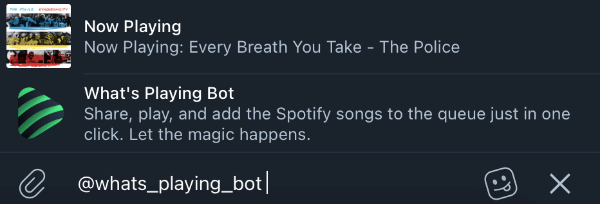

<p align="center">
  <a href="https://spotify.odintsov.me/" target="blank">
    
  </a>
</p>

<p align='center'><b>What's Playing Bot</b></p>
<p align="center">Share, play, and add the Spotify songs to the queue<br/>
just in one click. Let the magic happens.</p>

<p align='center'>
  <a href='https://send.monobank.ua/jar/6eys3tEKSX' rel='noopener' target='__blank'>
    
  </a>
</p>

## Description

The Telegram bot to share current playing track, search songs, and control spotify.

<table>
  <tbody>
    <tr>
      <td width="50%"></td>
      <td width="50%"></td>
    </tr>
  </tbody>
</table>

### Available commands

- /share - Share current track
- /s - Share current track
- /ss - Share current track without control buttons
- /next - Next track
- /previous - Previous track
- /me - Share profile link
- /unlink_spotify - Unlink
- /controls - Enable control keyboard
- /disable_controls - Disable control keyboard

Inline query is also supported



## Installation

```bash
$ yarn install
```

## Running the app

```bash
# development
$ yarn start

# watch mode
$ yarn start:dev

# production mode
$ yarn start:prod
```

## Environment variables

- `SPOTIFY_CLIENT_ID` - Get in [developer.spotify.com](https://developer.spotify.com/dashboard).
- `SPOTIFY_CLIENT_SECRET` - Get in [developer.spotify.com](https://developer.spotify.com/dashboard).
- `SPOTIFY_REDIRECT_URL` - The url to redirect to after the user grants or denies permission.
- `MONGO_URI` - MongoDB database url.
- `TELEGRAM_BOT_TOKEN` - Get it by contacting to [BotFather](https://t.me/BotFather).
- `JWT_SECRET` - JWT secret key.
- `TELEGRAM_JWT_SECRET` - JWT secret key.
- `TELEGRAM_SPOTIFY_CALLBACK_URI` - Callback url.
- `TELEGRAM_BOT_NAME` - Telegram bot username.
- `TELEGRAM_BOT_WEBHOOK_DOMAIN` - Telegram bot webhook domain.
- `TELEGRAM_BOT_WEBHOOK_PATH` - Telegram bot webhook path.
- `TELEGRAM_SECOND_BOT_TOKEN` - Get it by contacting to [BotFather](https://t.me/BotFather).
- `TELEGRAM_SECOND_BOT_WEBHOOK_DOMAIN` - Telegram second bot webhook domain.
- `TELEGRAM_SECOND_BOT_WEBHOOK_PATH` - Telegram second bot webhook path.
- `SITE` - Backend url.
- `FRONTEND_URL` - Frontend url.
- `FRONTEND_TITLE` - Frontend title.
- `FRONTEND_DESCRIPTION` - Frontend description.
- `BOT_LOGO_IMAGE` - Bot logo.
- `DEFAULT_COVER_IMAGE` - Default track cover.
- `QUEUE_HOST` - Redis host.
- `QUEUE_PORT` - Redis port.
- `QUEUE_DB` - Redis db.
- `CACHE_HOST` - Redis host.
- `CACHE_PORT` - Redis port.
- `CACHE_DB` - Redis db.

## Related

- [NestJS](https://github.com/nestjs/nest) - About
  A progressive Node.js framework for building efficient, scalable, and enterprise-grade server-side applications on top of TypeScript & JavaScript (ES6, ES7, ES8) 🚀
- [telegraf.js](https://github.com/telegraf/telegraf) - Modern Telegram Bot API framework for Node.js
