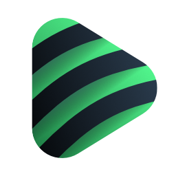
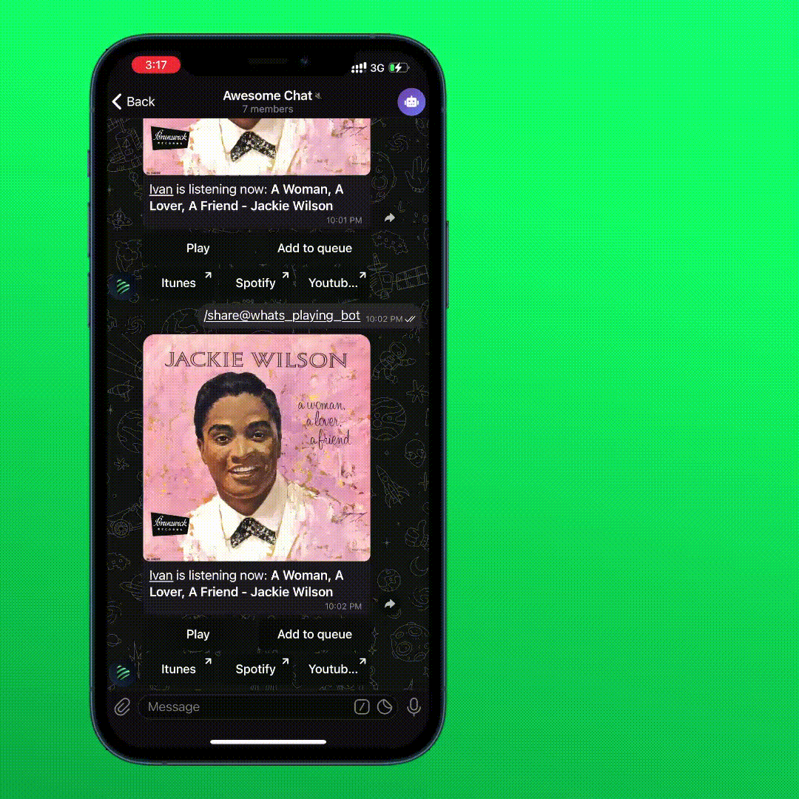
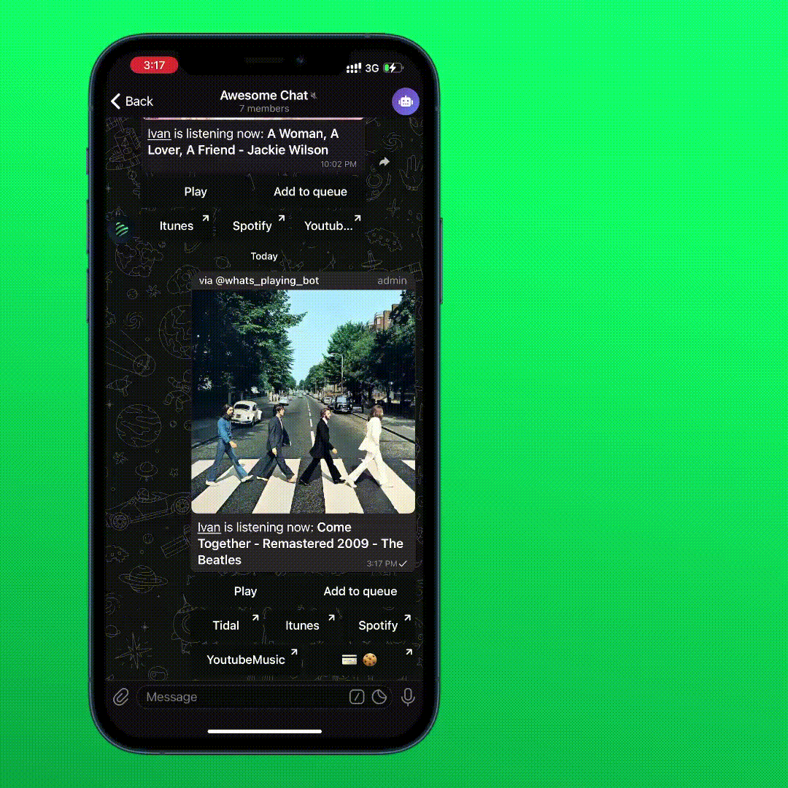
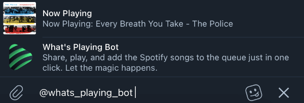

<p align="center">
  <a href="https://sharemusic.cc/" target="blank">
    
  </a>
</p>

<p align='center'><b>What's Playing Bot</b></p>
<p align="center">Share and discover music from Spotify and SoundCloud, <br/>listen to and queue Spotify tracks, all directly in Telegram with our Mini App and Bot. <br/>Music at your fingertips!</p>

<p align='center'>
  <a href='https://send.monobank.ua/jar/6eys3tEKSX' rel='noopener' target='__blank'>
    
  </a>
</p>

## Description

A Telegram bot for sharing your currently playing music, discovering tracks on Spotify and SoundCloud, and controlling Spotify playback.

<table>
  <tbody>
    <tr>
      <td width="50%"></td>
      <td width="50%"></td>
    </tr>
  </tbody>
</table>

### Available commands

- `/share` — Share your currently playing track.
- `/s` — Share your currently playing track.
- `/ss` — Share your currently playing track without playback controls.
- `/next` — Skip to the next Spotify track.
- `/previous` — Return to the previous Spotify track.
- `/me` — Share your profile.
- `/connect` — Connect your music services.
- `/unlink` — Disconnect your music services.
- `/controls` — Enable the playback control keyboard.
- `/disable_controls` — Disable the playback control keyboard.

The bot also supports inline queries for quickly sharing music in any chat.



## Installation

```bash
$ yarn install
```

## Running the app

```bash
# development
$ yarn start

# watch mode
$ yarn start:dev

# production mode
$ yarn start:prod
```

## Environment Variables

- `MUSIC_SERVICE_JWT_SECRET` - JWT secret used for music service authentication.
- `CONNECT_SERVICE_URL` - URL of the Connect Service.
- `CONNECT_MUSIC_SERVICE_CALLBACK_URL` - Callback URL used by the Connect Service after authentication.

### Spotify

- `SPOTIFY_CLIENT_ID` - Spotify application Client ID. Get in [developer.spotify.com](https://developer.spotify.com/dashboard).
- `SPOTIFY_CLIENT_SECRET` - Spotify application Client ID. Get in [developer.spotify.com](https://developer.spotify.com/dashboard).

### SoundCloud

- `SOUNDCLOUD_CLIENT_ID` - SoundCloud application Client ID. Get in [developers.soundcloud.com](https://developers.soundcloud.com/).
- `SOUNDCLOUD_CLIENT_SECRET` - SoundCloud application Client Secret. Get in [developers.soundcloud.com](https://developers.soundcloud.com/).

### Authentication

- `JWT_SECRET` - JWT secret key.
- `COOKIE_SECRET` - Secret used to sign cookies.
- `COOKIE_AUTH_DOMAIN` - Domain used for authentication cookies.

### Website

- `SITE` - Backend URL.
- `FRONTEND_URL` - Frontend URL.
- `DOMAIN` - Primary application domain.
- `BOT_LOGO_IMAGE` - URL of the bot logo image.
- `DEFAULT_COVER_IMAGE` - URL of the default track cover image.
- `DONATE_URL` - Donation page URL.

### Telegram

- `TELEGRAM_BOT_TOKEN` - Get it by contacting to [BotFather](https://t.me/BotFather).
- `TELEGRAM_JWT_SECRET` - JWT secret for Telegram authentication.
- `TELEGRAM_BOT_NAME` - Telegram bot username.
- `TELEGRAM_BOT_SHORT_NAME` - Telegram Mini App short name.
- `TELEGRAM_BOT_WEBHOOK_DOMAIN` - Telegram bot webhook domain.
- `TELEGRAM_BOT_WEBHOOK_PATH` - Telegram bot webhook path.
- `TELEGRAM_SECOND_BOT_TOKEN` - Get it by contacting to [BotFather](https://t.me/BotFather).
- `TELEGRAM_SECOND_BOT_WEBHOOK_DOMAIN` - Telegram second bot webhook domain.
- `TELEGRAM_SECOND_BOT_WEBHOOK_PATH` - Telegram second bot webhook path.

### Redis

#### Queue

- `QUEUE_HOST` - Redis host.
- `QUEUE_PORT` - Redis port.
- `QUEUE_DB` - Redis database index.

#### Cache

- `CACHE_HOST` - Redis host.
- `CACHE_PORT` - Redis port.
- `CACHE_DB` - Redis database index.

#### Locks

- `REDIS_DISTRIBUTION_HOST` - Redis host.
- `REDIS_DISTRIBUTION_PORT` - Redis port.
- `REDIS_DISTRIBUTION_DB` - Redis database index.

### Database

- `DB_DIALECT` - Database dialect (e.g. `postgres`).
- `DB_HOST` - Database host.
- `DB_PORT` - Database port.
- `DB_USER` - Database username.
- `DB_PASSWORD` - Database password.
- `DB_NAME` - Database name.
- `DB_IMPORT_PATH` - Path to import database dumps.
- `APP_MODE` - Application mode (e.g. `development` or `production`).

### Parsing

- `PARSE_ALBUMS_DURATION` - Cache lifetime for parsed albums.
- `PARSE_TRACKS_DURATION` - Cache lifetime for parsed tracks.
- `PARSE_ARTISTS_DURATION` - Cache lifetime for parsed artists.

### Analytics

- `MP_CLIENT_ID` - Google Analytics Measurement Protocol client ID.
- `MP_API_SECRET` - Google Analytics Measurement Protocol API secret.

### Frontend

- `GTM_ID` - Google Tag Manager container ID.
- `AD_TAG1` - Advertisement tag identifier.
- `AD_TAG2` - Advertisement tag identifier.
- `CORS_WHITELIST` - Comma-separated list of allowed CORS origins.

### Miscellaneous

- `SHORT_UUID_CHARS` - Characters used when generating short UUIDs.
- `PREMIUM_USERS` - Comma-separated list of premium user IDs.

## Related

- [NestJS](https://github.com/nestjs/nest) - A progressive Node.js framework for building efficient, scalable, and enterprise-grade server-side applications on top of TypeScript & JavaScript (ES6, ES7, ES8) 🚀
- [grammY](https://github.com/grammyjs/grammY) - The Telegram Bot Framework.
